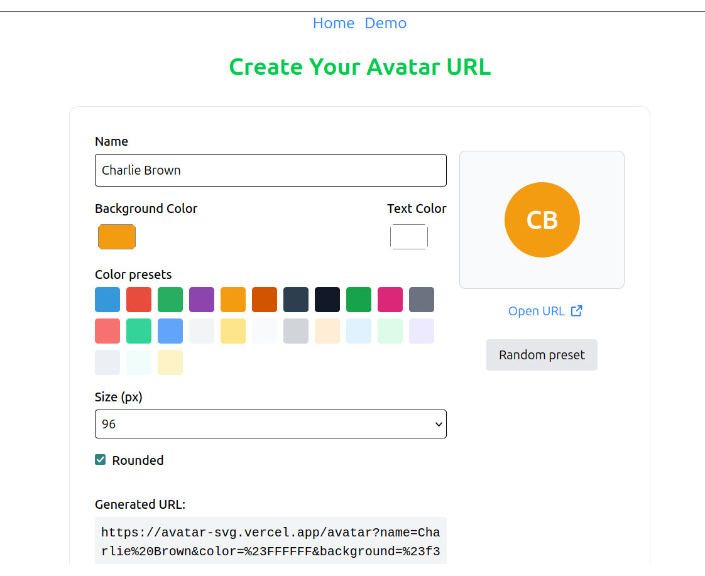

# Nuxt Avatar Generator

A simple Nuxt application that generates SVG avatars based on user names. It extracts initials (two letters) from the provided text and renders a clean, scalable avatar with customizable text color, background color, and size via query parameters. Ideal for profile placeholders, user lists, and any UI that needs lightweight, fast, cache-friendly avatars.

## [Demo](https://avatar-svg.vercel.app/)



## Nuxt Minimal Starter

Look at the [Nuxt documentation](https://nuxt.com/docs/getting-started/introduction) to learn more.

## Setup

Make sure to install dependencies:

```bash
# npm
npm install
```

## Development Server

Start the development server on `http://localhost:3000`:

```bash
# npm
npm run dev
```

## Production

Build the application for production:

```bash
# npm
npm run build
```

Locally preview production build:

```bash
# npm
npm run preview
```

Check out the [deployment documentation](https://nuxt.com/docs/getting-started/deployment) for more information.
